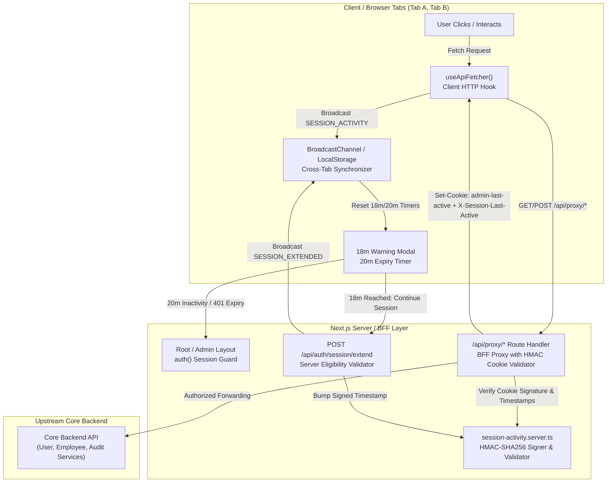
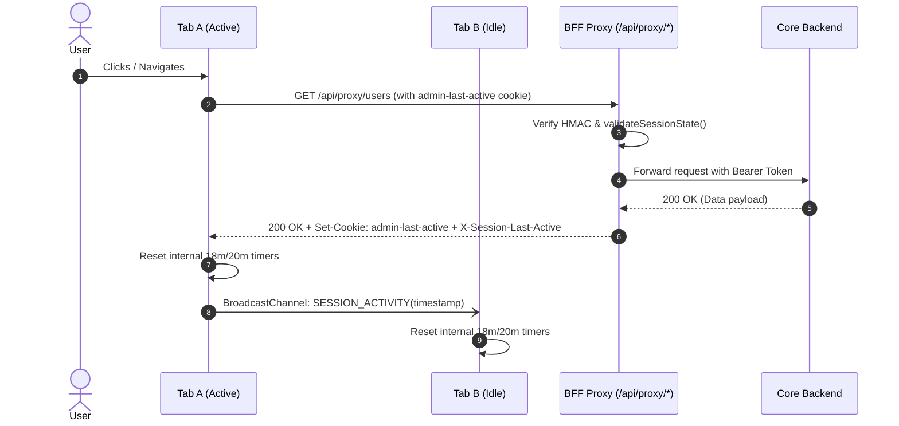
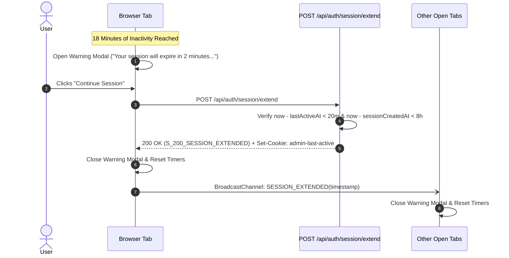
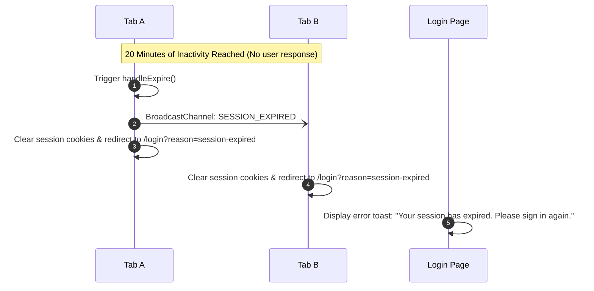

# Session Management & Inactivity Invalidation Architecture

## 1. Executive Summary & BRD Requirements

This document details the architectural design, implementation strategy, and security model for enterprise session inactivity management in the Platform Admin Web Application.

### Business Requirements (BRD)

1. **10-Minute Inactivity Expiry**: The user session automatically terminates after **10 continuous minutes** without qualifying user activity.
2. **8-Minute Warning Modal with Live Countdown**: At exactly **8 minutes of inactivity** (2 minutes prior to expiry), an un-dismissible modal alerts the user with a live ticking countdown (`2:00`, `1:59`, `1:58`, ...):
   > _"Your session will expire in 2:00 due to inactivity. Select Continue Session to remain signed in."_
3. **Eligible Session Extension**: Clicking **"Continue Session"** invokes a server-side endpoint (`POST /api/auth/session/extend`) which verifies eligibility and resets the inactivity timer.
4. **8-Hour Absolute Maximum Ceiling**: The total session duration can never exceed **8 continuous hours** from the initial login timestamp, regardless of activity or extensions.
5. **Cross-Tab Synchronization**: Inactivity timers, warning modal states, and expiration logouts are synchronized across all open browser tabs in real time.
6. **Qualifying Activity vs. Background Polling Isolation**: User interactions (table browsing, form submissions, navigation) extend the session, while automated background polling tasks do not prolong the session.

---

## 2. Architecture Overview



---

## 3. Why: Architectural Motivation & Problems Solved

| Problem                                                   | Root Cause                                                                                                                | Architectural Solution                                                                                            |
| :-------------------------------------------------------- | :------------------------------------------------------------------------------------------------------------------------ | :---------------------------------------------------------------------------------------------------------------- |
| **Session Hijacking / Stale Logins**                      | Long-lived JWT tokens remaining valid for days without server awareness.                                                  | Stateless cryptographic activity companion cookie (`admin-last-active`) validated on every proxy call.            |
| **Inactivity Timer Drift across Tabs**                    | Multiple tabs maintaining independent client timers leading to premature logout in Tab A while working in Tab B.          | Real-time `BroadcastChannel` event bus with `localStorage` storage event fallback.                                |
| **Background Polling Artificially Keeping Session Alive** | Metric pollers or health checks resetting inactivity timers indefinitely.                                                 | `X-Background-Activity` header contract allowing requests to authenticate without refreshing `admin-last-active`. |
| **Redundant Server Load on Mount**                        | Unseeded client NextAuth `<SessionProvider>` firing asynchronous `GET /api/auth/session` calls on every render and focus. | Pre-hydrating `SessionProvider` with server `session` in `RootLayout` and disabling `refetchOnWindowFocus`.       |
| **Client/Server Timing Desync**                           | Client attempting to extend a session that already expired on the server.                                                 | Strict server-side verification in `POST /api/auth/session/extend` before returning renewed activity cookies.     |

---

## 4. How: Component Breakdown & Implementation

### 4.1. Server-Side Cryptographic Token Engine (`session-activity.server.ts`)

- **HMAC-SHA256 Signatures**: Generates stateless signed tokens in the format `<timestamp>.<hmac-sha256>`.
- **Constant-Time Verification**: Uses `crypto.timingSafeEqual()` to eliminate timing attack vectors.
- **Strict Validation Matrix**:
  ```ts
  export function validateSessionState(
    sessionCreatedAt: number,
    lastActiveAt: number,
    now = Date.now(),
  ): SessionValidationResult {
    // 1. 8-Hour Absolute Limit Check (Strict Priority)
    if (now - sessionCreatedAt >= ABSOLUTE_TIMEOUT_MS) {
      return {
        valid: false,
        reason: SESSION_EXPIRY_REASONS.ABSOLUTE_LIMIT_REACHED,
      };
    }
    // 2. 20-Minute Inactivity Check
    if (now - lastActiveAt >= INACTIVITY_TIMEOUT_MS) {
      return {
        valid: false,
        reason: SESSION_EXPIRY_REASONS.INACTIVITY_TIMEOUT,
      };
    }
    return { valid: true };
  }
  ```

### 4.2. BFF Proxy Route Guard (`/api/proxy/[...path]/route.ts`)

- Serves as the single gateway for all client API traffic.
- Validates the incoming `admin-last-active` cookie against `validateSessionState()`.
- Guarantees timestamp sanity: `lastActiveAt = Math.max(sessionCreatedAt, rawLastActiveAt)` so stale cookies from previous sessions cannot invalidate fresh logins.
- Sets the updated signed `admin-last-active` cookie and returns `X-Session-Last-Active` header on qualifying user requests.

### 4.3. Session Extension Endpoint (`POST /api/auth/session/extend`)

- Handles explicit **"Continue Session"** user clicks from the warning modal.
- Verifies server-side eligibility:
  - If `now - lastActiveAt < 20m` and `now - sessionCreatedAt < 8h`: Extends session by updating `admin-last-active` to `now` and returns HTTP 200 with remaining TTL.
  - If already expired: Rejects with HTTP 401 `INACTIVITY_TIMEOUT` or `ABSOLUTE_LIMIT_REACHED`.

### 4.4. Cross-Tab Synchronization (`session-sync.ts`)

- Publishes lightweight event envelopes over a dedicated `BroadcastChannel` (`platformadmin_session_sync`).
- Supported event types:
  - `SESSION_ACTIVITY`: Emitted when an API response confirms qualifying activity.
  - `SESSION_EXTENDED`: Emitted when user extends session in any tab.
  - `SESSION_EXPIRED`: Emitted when inactivity timeout triggers logout.
  - `SESSION_LOGOUT`: Emitted on manual user sign-out.

### 4.5. Client Inactivity Watcher (`session-inactivity-watcher.tsx`)

- Mounted in `AdminLayout` across all authenticated admin routes.
- Pre-hydrated with `initialLastActiveAt` resolved on the server via `getInitialLastActiveAt(session)` from the signed `admin-last-active` cookie during full page load or refresh (F5).
- Runs precision client timers:
  - `warningTimer` (`lastActiveAt + 8 minutes`): Triggers the modal dialog with live ticking countdown.
  - `expiryTimer` (`lastActiveAt + 10 minutes`): Triggers automatic sign-out.
- Listens to cross-tab events to dismiss the modal automatically if activity happens elsewhere.
- Re-evaluates timers on `document.visibilitychange` and window `focus`.

---

## 5. Sequence Flows

### 5.1. Normal User Activity (Session Kept Alive)



### 5.2. 18-Minute Inactivity Warning & Session Extension



### 5.3. 20-Minute Expiration (Automatic Sign-Out)



---

## 6. Centralized Configuration Reference

All constants reside in [`src/lib/auth/session-constants.ts`](file:///Users/tp-shaktish/projects/platformadmin-webapp-main/src/lib/auth/session-constants.ts):

| Constant                      | Value                          | Description                                                      |
| :---------------------------- | :----------------------------- | :--------------------------------------------------------------- |
| `INACTIVITY_TIMEOUT_MS`       | `600,000` (10 min)             | Max continuous inactivity permitted before session invalidation. |
| `WARNING_TIME_MS`             | `480,000` (8 min)              | Timestamp when inactivity warning modal is displayed.            |
| `WARNING_WINDOW_MS`           | `120,000` (2 min)              | Countdown window before forced expiration.                       |
| `ABSOLUTE_TIMEOUT_MS`         | `28,800,000` (8 hours)         | Hard session ceiling from initial authentication.                |
| `LAST_ACTIVE_COOKIE_NAME`     | `"admin-last-active"`          | HttpOnly signed cookie tracking last verified server activity.   |
| `SESSION_SYNC_CHANNEL_NAME`   | `"platformadmin_session_sync"` | BroadcastChannel topic for multi-tab synchronization.            |
| `SESSION_EXPIRED_QUERY_PARAM` | `"session-expired"`            | Query parameter for login screen expiration alerts.              |

---

## 7. Verification & Quality Metrics

- **Unit & Integration Tests**: 56 test files, 316 tests passing (Vitest).
- **Static Code Analysis**: ESLint 0 warnings / 0 errors.
- **Style Compliance**: Stylelint 0 errors.
- **Security Validation**: Cryptographic constant-time comparison, HttpOnly cookie protection, strict absolute session ceilings.
